<!-- Generated by scripts/render_docs.py from docs/templates/README.md. Edit the template, not this file. -->
# Offshore Asset Risk & Resilience Engine

A quantitative operational-risk model for a **fictional** six-platform offshore
oil and gas complex. It follows operational hazards from failure frequencies,
through protection-layer reliability and event sequences, to physical damage,
production interruption and an annual loss distribution. It then asks which
assumptions drive that distribution and which controls reduce it most for a
fixed budget.

> **Scope.** The asset, every parameter and all "historical" records are
> fictional or synthetic. No confidential or company data is used, and no value
> should be read as a statistic for any real facility or operator. The model
> demonstrates methods and their sensitivities; it does not predict real
> accidents. Every parameter carries its basis, rationale and uncertainty range
> in the [data dictionary](docs/data_dictionary.md).

---

## Contents

1. [Why this project exists](#1-why-this-project-exists)
2. [The risk problem](#2-the-risk-problem)
3. [System architecture](#3-system-architecture)
4. [Methodology](#4-methodology)
5. [Data methodology](#5-data-methodology)
6. [Results](#6-results)
7. [Dashboard](#7-dashboard)
8. [Key findings](#8-key-findings)
9. [Limitations](#9-limitations)
10. [How to run](#10-how-to-run)
11. [Testing and quality checks](#11-testing-and-quality-checks)
12. [Future improvements](#12-future-improvements)

## 1. Why this project exists

Offshore fire-protection and HSE engineering usually asks *"is this barrier
adequate?"* Enterprise risk management asks *"what is our exposure, how
uncertain is it, and where should the next dollar go?"* This repository connects
the two. The safety engineer's tools (fault trees, event trees, PFD
calculations, common-cause modelling) feed the ERM function's tools (loss
distributions, VaR and expected shortfall, appetite limits, portfolio
optimisation, sensitivity analysis). Each layer is simple enough to check by hand.

## 2. The risk problem

For the fictional complex *Meridian* (40 kbbl/d, six bridge-linked platforms):

1. What does the **distribution** of annual operational loss look like, not just its mean?
2. Which sources drive the **average year**, and which drive the **tail**?
3. Where does **system architecture** (shared power, common cause) undermine apparent redundancy?
4. How much of the uncertainty is **randomness**, and how much is **not knowing the parameters**?
5. With a **USD 5.0 M** budget, which controls should be funded? Does the answer depend on the risk measure?

## 3. System architecture

```text
config/*.yaml ─► load_config ─► validate_config (schema, ranges, cross-references)
                    │  ParameterRegistry: value, unit, distribution, basis, rationale
                    │  θ (epistemic draw)
   reliability ─► fault_tree ─► simulation/derived ◄── bayesian (posteriors from synthetic records)
   (PFD, k-of-n,   (exact,       (rates, PFDs,
    Weibull NHPP,   cut sets,     branch probabilities)
    CCF)            importance)        │
                                       ▼
   asset (dependency graph → 64-state capacity table)   event_tree (release sequences)
                                       │
                                       ▼
             simulation/engine: year drivers (Model A / B) → thinned Poisson events
             → event-tree outcomes, escalation, downtime → financial/loss_model
                                       │
      ┌──────────────┬─────────────┬───┴────────┬──────────────┬──────────────┐
   metrics        nested        scenarios    mitigation →   sensitivity    appetite
 (EAL, VaR, ES,  (epistemic vs  (7 stress    optimization   (tornado,      (hypothetical
  LEC, Euler     aleatory)      cases)       (MILP)         Spearman, S1)   limits)
  allocation)
```

Business logic lives in `src/offshore_risk/`; the dashboard, notebooks and
plotting code only call it. Full design: [docs/methodology.md](docs/methodology.md).

```text
offshore-risk-engine/
├── config/          asset, risk parameters, mitigations, scenarios, risk appetite (YAML, validated on load)
├── data/            raw/ (empty by design), synthetic/ (generated), processed/
├── src/offshore_risk/
│   ├── reliability/  fault_tree/  event_tree/  bayesian/  asset/
│   ├── simulation/   financial/   scenarios/   appetite/  mitigation/
│   ├── optimization/ sensitivity/ data/        visualization/
│   └── config.py, config_validation.py, distributions.py
├── scripts/         generate data, run analysis, run validation, render docs, build notebooks
├── notebooks/       01–05, executed; thin wrappers around the library
├── dashboard/       Streamlit app (local only)
├── tests/           pytest suite (? tests)
├── outputs/         results/ (CSV, JSON) and figures/ (PNG) from the full run
└── docs/            methodology, assumptions, data dictionary, validation, limitations, research notes
```

## 4. Methodology

| Layer | Method | Why it is needed |
|---|---|---|
| Failure frequency | Release rate = sum of cause rates (valve, flange, corrosion, PTW × isolation failure, overpressure demand × PSV PFD); Weibull power-law NHPP for compressors; repairable 2oo3 + β-factor for power | Controls act on causes; wear-out makes overhaul timing matter; redundancy vs common cause |
| Protection layers | PFDavg (simplified IEC 61508-6 forms) for k-oo-n voted groups with β-factor CCF; fire-protection fault tree evaluated **exactly** by Shannon decomposition on shared events | The electric firewater pumps share main power; naive multiplication understates firewater unavailability 2.1× |
| Event sequences | Release event tree: detection → isolation → ignition → explosion → fire protection → escalation across bridges | Converts barrier reliability into outcome probabilities |
| Interdependency | Directed dependency graph (power, well fluids, export route, manning, water injection) → capacity for all 64 down-states | A PPA outage costs 78 % of output, not its own 55 % |
| Uncertainty | Epistemic parameters (per world) vs aleatory variability (per year and event); pooled and **two-loop nested** simulation | Separates "what we don't know" from "what is random" |
| Dependence | Year-level drivers (weather, logistics, integrity): Model A independent, Model B Gaussian copula with identical marginals | Isolates the effect of co-movement on the tail |
| Finance | Direct (damage, repair, emergency response, logistics, restart) vs indirect (lost bbl × price × value fraction); environmental proxy monetised only as an explicit scenario assumption | Keeps speculative costs out of the totals |
| Bayesian | Beta-Binomial (pump start tests) and Gamma-Poisson (trip rate) on synthetic records; posteriors feed the model | Shows how evidence narrows uncertainty |
| Decisions | Controls as parameter transforms, re-simulated with **common random numbers**; MILP with pairwise interaction terms, checked against exhaustive search | Measured, not assumed, risk reduction |
| Sensitivity | Tornado (P10/P90, common random numbers), Spearman on nested worlds, binned first-order variance index | Answers "which assumptions matter most?" |

### Key equations

* Release frequency (platform *p*): $\lambda_p = k_p[\lambda_{valve}+\lambda_{flange}+\lambda_{corr}+n_{jobs}q_{PTW}p_{rel}+\lambda_{dem}\mathrm{PFD}_{PSV}]$
* Weibull NHPP expected failures in the coming year: $\Lambda = ((a+1)/\eta)^\beta-(a/\eta)^\beta$
* PFD of a *k*oo*n* group: $\binom{n}{m}\frac{((1-\beta)\lambda_{DU}T)^m}{m+1}+\beta\frac{\lambda_{DU}T}{2}$, $m=n-k+1$
* Exact fault-tree probability with a shared event *x*: $P = p_x P(\cdot|x{=}1)+(1-p_x)P(\cdot|x{=}0)$
* Business interruption: lost bbl × oil price × value fraction; lost bbl $=\sum_k (t_k-t_{k-1})(Q-C(S_k))$
* $\mathrm{ES}_\alpha = E[L \mid L\ge \mathrm{VaR}_\alpha]$; Euler allocation $\mathrm{ES}_\alpha=\sum_s E[L_s\mid L\ge\mathrm{VaR}_\alpha]$
* Portfolio: $\max \sum a_i x_i+\sum b_{ij}y_{ij}$ s.t. $\sum c_i x_i\le B$, with $y_{ij}$ linearising $x_ix_j$

## 5. Data methodology

* **No confidential data.** `data/raw/` is empty by design.
* **Parameters** are assumptions recorded in YAML with definition, unit,
  distribution, basis (`assumption`, `order_of_magnitude`, `engineering_convention`,
  `synthetic_calibrated`), rationale and uncertainty. The configuration is
  validated on load (required fields, probability ranges, cross-references, an
  acyclic dependency graph). The [data dictionary](docs/data_dictionary.md) is
  generated from the same YAML.
* **Synthetic records** (12 years: incident log, 1,878 pump start tests,
  equipment register, exposure) are generated by the model from a documented
  synthetic truth with a fixed seed. They exercise the Bayesian module; the
  argument is circular by construction and is labelled as such.
* **No invented citations.** "Order of magnitude" parameters name the *type* of
  public source whose range they sit in (regulator release statistics,
  reliability handbooks, pipeline loss-of-containment compilations). The
  numbers themselves are assumptions.
* **Numbers in this README are generated** from `outputs/results/` by
  `scripts/render_docs.py`, which also checks that the qualitative statements
  below still hold.

## 6. Results

Unless stated otherwise: `python scripts/run_analysis.py`, seed 20260927, Model B,
posterior-updated parameters, 100,000 simulated years. All money in USD millions.

### Annual loss distribution

| Metric | USD M | Reading |
|---|---:|---|
| Expected annual loss (EAL) | **22.6** (90 % CI 22.4–22.9) | long-run average; basis for cost-benefit |
| Median year | 13.4 | a typical year is 59 % of the EAL |
| P75 / P90 | 24.8 / 42.3 | |
| P95 = VaR95 | **60.8** | 1-in-20-year loss |
| P99 = VaR99 | **186** (179–195) | 1-in-100-year loss |
| ES95 / ES99 | 148 / **363** (348–379) | mean of the worst 5 % / 1 % of years |
| P(loss > 100 M) | 2.2 % | about 1 year in 45 |
| P(loss > 500 M) | 0.17 % | about 1 year in 592 |

Intervals are 90 % bootstrap intervals for Monte Carlo error only; parameter
uncertainty is shown separately below.

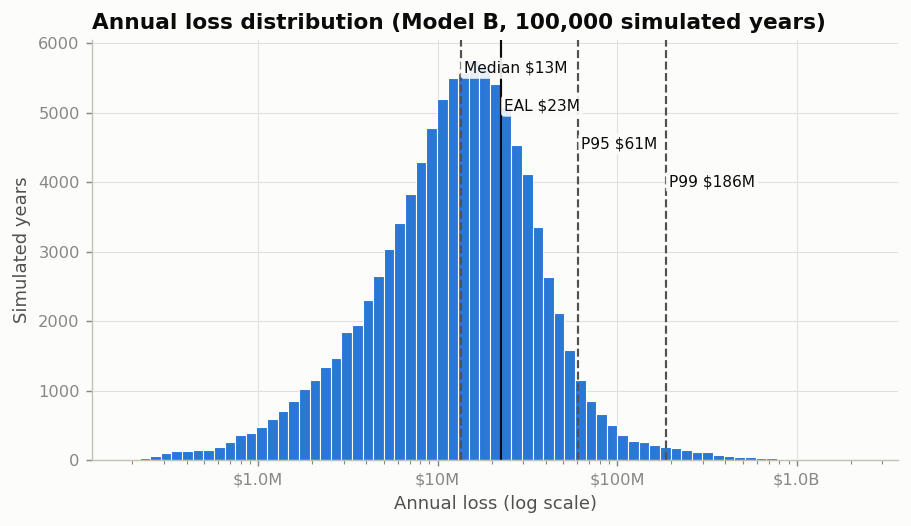

Business interruption is 83 % of expected loss (USD 18.7 M/yr). Direct costs
(restart, repair, damage, emergency response, logistics) make up the rest. The
worst 1 % of years carry 16 % of all loss.

### The average year and the tail are driven by different things

| Source | Share of EAL | Share of ES99 |
|---|---:|---:|
| Hydrocarbon releases (incl. fires/explosions) | 36 % | 66 % |
| Compressor failures | 23 % | 2 % |
| Extreme weather shut-ins | 14 % | 1 % |
| Spurious trips | 13 % | 1 % |
| Export pipeline | 10 % | 28 % |
| Total power loss | 3 % | <1 % |
| Vessel collision | 1 % | 1 % |

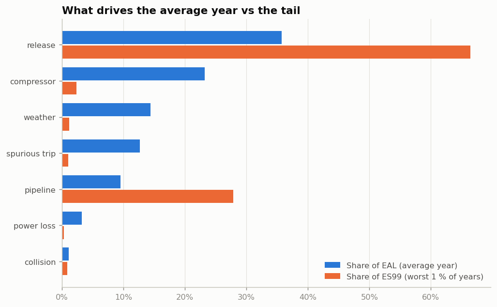

### Architecture matters: shared power under redundant pumps

At median parameters, the firewater probability of failure on demand for a
fire on a production platform is **0.0060** when evaluated exactly and
**0.0028** if the electric pumps are (wrongly) treated as independent.
The shared main-power supply accounts for the difference. For a fire on the
utility platform, where main power is likely to be lost, the exact value is
0.025. The most important basic event in the fire-protection fault tree
is `DELUGE_VALVE_FAIL` (Fussell–Vesely 68 %).

### Dependence: Model A vs Model B

| USD M | EAL | P90 | P95 | P99 | ES99 |
|---|---:|---:|---:|---:|---:|
| Model A (independent drivers) | 22.0 | 39.9 | 56.3 | 181 | 354 |
| Model B (correlated drivers) | 22.6 | 42.3 | 60.8 | 186 | 363 |

Correlated year-level drivers change P90 by +6 % and P95 by +8 %.
That is where bad years are built from several moderate events. ES99 changes by
only +3 %, because the extreme tail is made of single major accidents. Event
frequencies are identical in both models (ratio 1.004, validated).

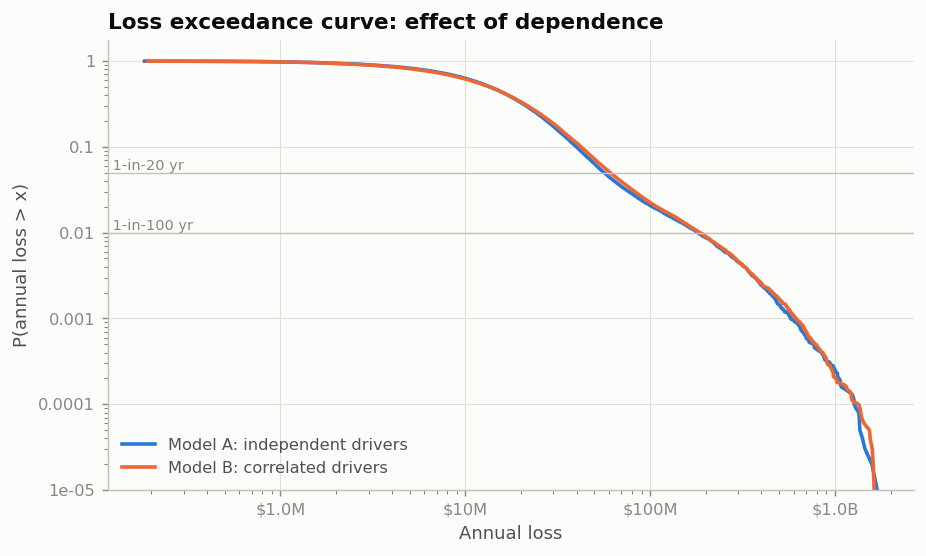

### Uncertainty vs risk

A two-loop run (400 parameter "worlds" × 1,000 years) separates the two:

| Metric (USD M) | 5 % of worlds | median world | 95 % of worlds |
|---|---:|---:|---:|
| EAL | 13.6 | 21.9 | 33.8 |
| P99 | 76.9 | 159 | 304 |
| ES99 | 161 | 320 | 583 |

Parameter uncertainty alone spans a factor of about 2.5 in the EAL and
3.6–4.0 in the tail metrics (P99, ES99). The randomness of a year can only be absorbed
(resilience, insurance, contingency). The uncertainty about the parameters can
be *reduced* with data, and the sensitivity analysis shows where to collect it.

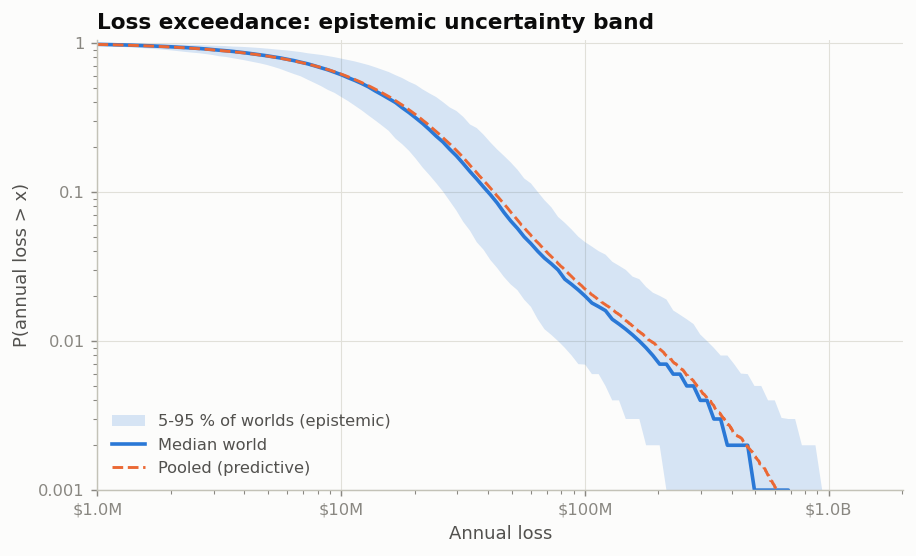

### Which assumptions matter most?

| Rank | Parameter | EAL swing P10→P90 (USD M) | Spearman ρ (EAL) | First-order index |
|---:|---|---:|---:|---:|
| 1 | `bi_value_fraction` | 8.3 | +0.61 | 0.38 |
| 2 | `ptw_isolation_failure_prob` | 4.2 | +0.29 | 0.15 |
| 3 | `rel_flange_seal_rate` | 3.5 | +0.28 | 0.12 |
| 4 | `pipeline_rate_per_km_yr` | 3.3 | +0.25 | 0.07 |
| 5 | `rel_valve_rate` | 3.0 | +0.22 | 0.09 |
| 6 | `comp_repair_days` | 3.3 | +0.20 | 0.06 |
| 7 | `comp_weibull_scale_years` | 3.1 | -0.20 | 0.05 |
| 8 | `weather_rate` | 3.3 | +0.16 | 0.04 |

`bi_value_fraction` (the economic value of a deferred barrel) is clearly first (ρ = 0.61,
first-order index 0.38). The ordering of the next few parameters is **not
robust**: from rank 2 onwards (ρ = 0.29 and below), neighbouring correlations
differ by less than the sampling error of ρ (≈ ±0.05 with 400 worlds), so ranks
2–8 are best read as one group of second-order drivers. For the tail (ES99), the
leading parameters are `bi_value_fraction`, `ptw_isolation_failure_prob`, `pipeline_repair_days`, `pipeline_rate_per_km_yr`, `rel_flange_seal_rate`, `rel_valve_rate`. Protection-system reliability
parameters do not appear among the leading drivers at this asset's fire
frequency (~0.020 fires/yr). The tornado's base case (all parameters at their medians) has an EAL of
19.0, below the pooled EAL, because the parameter distributions are right-skewed.

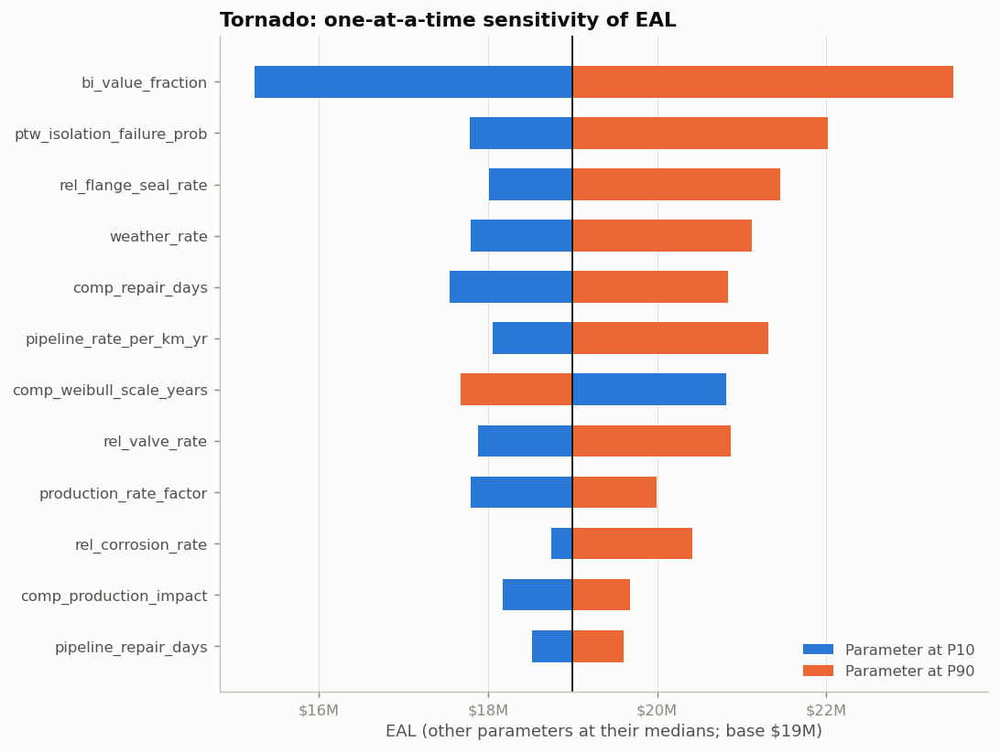

### Stress scenarios (conditional)

| Scenario | Annual frequency | Mean loss of the event (USD M) | Conditional P99 of the year (USD M) |
|---|---:|---:|---:|
| S1 Single equipment failure | 0.73 /yr | 7.1 | 190 |
| S2 Firewater system degradation | state | +0.07 M/yr | 181 |
| S3 Major hydrocarbon release | 0.011 /yr | 15.0 | 475 |
| S4 Multi-platform shutdown | 1.8e-05 /yr | 431 | 1,185 |
| S5 Extreme weather + equipment failure | 0.0089 /yr | 40.1 | 320 |
| S6 Common-cause power failure | 0.083 /yr | 10.6 | 195 |
| S7 High commodity price + prolonged outage | 0.0021 /yr | 426 | 1,536 |

S2 is instructive. Degrading the firewater system raises the fire-protection
PFD from 0.024 to 0.030 but adds only USD 0.07 M to the expected annual loss. An
expected-value view alone would under-rate firewater integrity. (Scenarios use
25,000 years with the same random numbers as the baseline.)

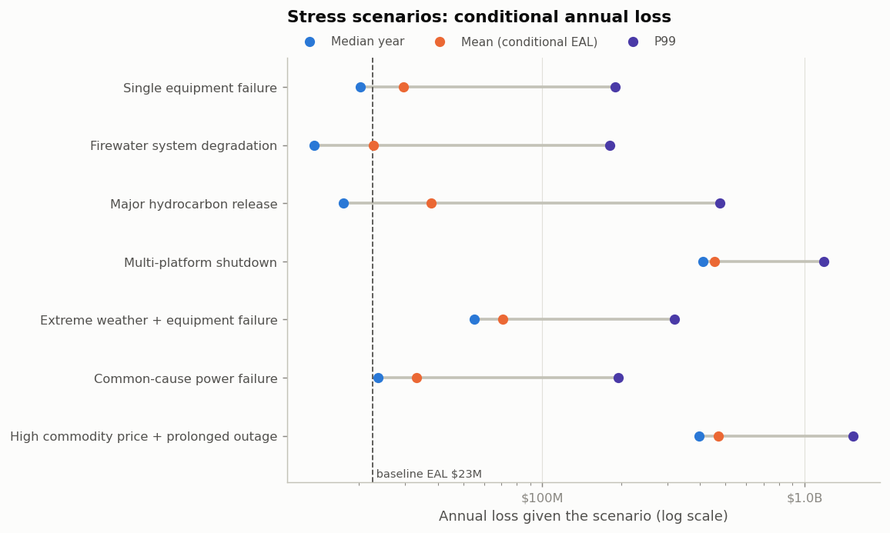

### Controls and the budget

| Control | Capex (USD M) | EAL reduction, USD M/yr (±SE) | ES99 reduction (USD M) | Annualised cost per USD of EAL reduced |
|---|---:|---:|---:|---:|
| Critical spares holding (reduced repair time) | 2.5 | 2.30 (±0.03) | 33.0 | 0.21 |
| Improved gas detection coverage | 1.5 | 1.80 (±0.07) | 37.3 | 0.11 |
| Improved compressor preventive maintenance | 1.2 | 1.62 (±0.02) | 2.7 | 0.31 |
| Increased inspection frequency (risk-based inspection) | 0.8 | 0.82 (±0.05) | 16.0 | 0.55 |
| Permit-to-work and isolation competence programme | 0.5 | 0.74 (±0.06) | 16.3 | 0.37 |
| Fourth gas-turbine generator | 3.5 | 0.28 (±0.01) | 0.36 | 1.79 |
| Additional diesel firewater pump | 2.2 | 0.09 (±0.03) | 8.3 | 2.90 |
| Additional deluge coverage and valve duplication | 1.8 | 0.06 (±0.02) | 5.1 | 3.94 |
| Faster emergency response | 0.6 | 0.01 (±0.01) | 1.3 | 13.55 |

**The optimal portfolio depends on the objective.** The MILP result is confirmed by exhaustive search over all 114 feasible portfolios:

| Objective | Selected controls | Capex (USD M) | EAL reduction | ES99 reduction (USD M) |
|---|---|---:|---:|---:|
| Minimise expected loss | Increased inspection frequency (risk-based inspection) + Improved compressor preventive maintenance + Critical spares holding (reduced repair time) + Permit-to-work and isolation competence programme | 5.0 | 4.88 M/yr | 65.2 |
| Minimise ES99 (tail) | Improved gas detection coverage + Critical spares holding (reduced repair time) + Permit-to-work and isolation competence programme | 4.5 | 4.58 M/yr | 85.5 |
| Maximise net benefit (EAL reduction − annualised cost) | Improved gas detection coverage + Critical spares holding (reduced repair time) + Permit-to-work and isolation competence programme | 4.5 | 4.58 M/yr | 85.5 |

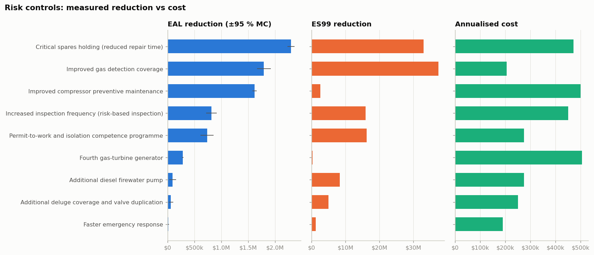

### Risk appetite

| Limit (hypothetical) | Value | Limit | Status |
|---|---:|---:|---|
| Expected annual operational loss (EAL) | 22.6 M | 25.0 M | Near threshold (90 %) |
| 1-in-20-year annual loss (P95) | 60.8 M | 70.0 M | Near threshold (87 %) |
| P95 of annual lost production, in equivalent days of full-complex shutdown | 31.0 d | 25.0 d | Outside appetite (124 %) |
| 1-in-100-year largest single-event loss (P99 of the annual maximum event loss) | 160 M | 250 M | Within appetite (64 %) |
| Firewater system probability of failure on demand (fire on a production platform) | 0.00742 | 0.01 | Within appetite (74 %) |
| Overall fire-protection function PFD (firewater, deluge, detection) on a production platform | 0.0241 | 0.05 | Within appetite (48 %) |

All limits are hypothetical management thresholds for the fictional operator,
not industry or regulatory criteria.

## 7. Dashboard

`streamlit run dashboard/app.py` opens six views: Executive, Asset, Scenarios,
Monte Carlo, Mitigation and Sensitivity. The sidebar sets the sample size,
dependence model, Bayesian updating, seed and the controls in place, and every
view updates from the library. The server listens on `localhost` only and
usage statistics are disabled (`.streamlit/config.toml`). Screenshots use the
default 20,000 simulated years, so their figures differ slightly from the
results above.

| Executive | Scenarios |
|---|---|
| 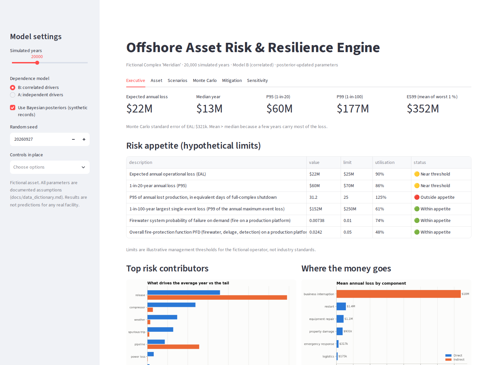 | 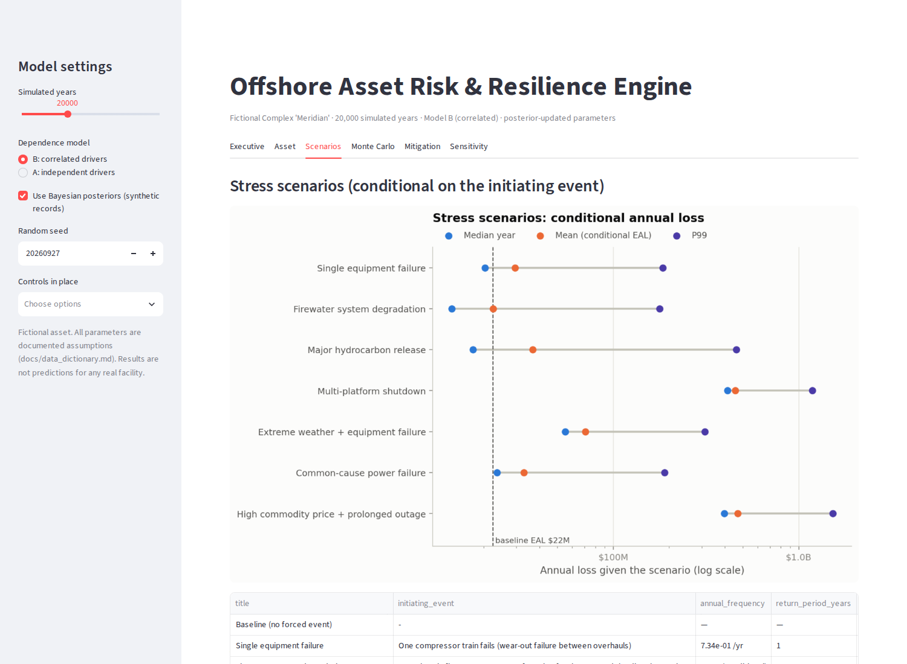 |
| **Mitigation** | **Sensitivity** |
| 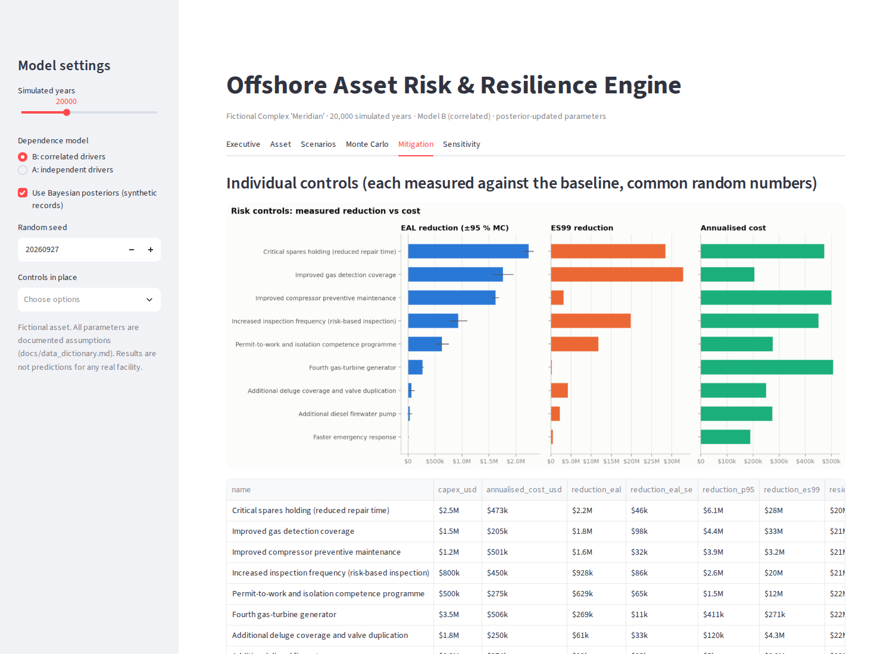 | 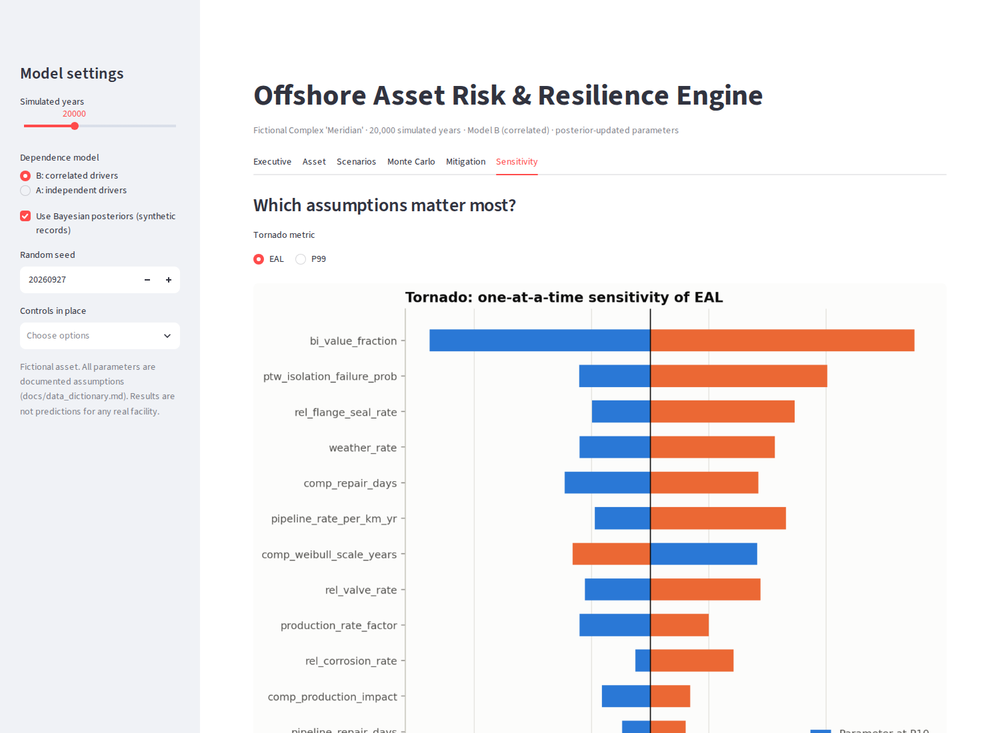 |

## 8. Key findings

These apply to this fictional asset under these assumptions.

1. **The economic assumption outweighs the engineering ones.** What a deferred
   barrel is worth moves the EAL more than any failure rate. It should be pinned
   down first.
2. **Mean and tail are different problems.** Compressors, weather, trips and
   power losses are 54 % of the EAL but 5 % of ES99.
   Releases and the export pipeline are 94 % of ES99.
3. **Redundancy is weaker than it looks where support systems are shared.**
   Modelling the common power supply raises firewater unavailability 2.1×. A
   fourth generator costs USD 1.8 per dollar of EAL reduced, because the
   common-cause loss of power (68 % of the total at median parameters) is untouched.
4. **Detection and isolation are the economically decisive barrier.**
   Improved gas detection coverage is the most cost-effective control (USD 0.11 per dollar
   of EAL reduced) and the largest tail reducer. Undetected releases become
   unisolated ones, which shut the complex down even when they do not ignite.
5. **Firewater, deluge and emergency-response controls look poor on expected
   value** but reduce fire-protection unavailability (from 0.024 to
   0.020 with an extra pump, 0.016 with deluge duplication). Funding them
   is a safety and appetite decision, not an expected-value one.
6. **Correlation between risks thickens the upper-middle of the distribution**
   (P95 +8 %), not the extreme tail (ES99 +3 %).
7. **Parameter uncertainty is as large as the risk signal** (EAL 13.6–33.8 M across
   plausible worlds), so collecting data on the top-ranked parameters has real value.

## 9. Limitations

The main ones are listed here; the full list is in
[docs/limitations.md](docs/limitations.md).

* Economic risk only: no individual or societal risk.
* No consequence physics: fire and explosion outcomes are classes with assumed damage and downtime.
* Simplified PFD formulas and β-factor CCF.
* A Gaussian copula, which has no tail dependence.
* Gross, pre-insurance losses.
* Blowouts and subsea equipment are not modelled.
* The synthetic data is generated by the model itself.

## 10. How to run

```bash
git clone <repository-url> offshore-risk-engine && cd offshore-risk-engine
python -m venv .venv && source .venv/bin/activate      # Python 3.10+
pip install -r requirements.txt && pip install -e .

python scripts/generate_synthetic_data.py   # data/synthetic/*.csv (fixed seed)
python scripts/build_data_dictionary.py     # docs/data_dictionary.md
python scripts/run_analysis.py              # outputs/results + outputs/figures (~2 min)
python scripts/run_validation.py            # docs/validation_results.md (~2 min)
python scripts/render_docs.py               # README.md and docs/ numbers from outputs/
python scripts/build_notebooks.py           # executes notebooks/01–05
streamlit run dashboard/app.py
```

`make all` runs the whole chain. From Python:

```python
from offshore_risk import load_config
from offshore_risk.simulation import simulate
from offshore_risk.financial.metrics import risk_metrics

cfg = load_config()                       # validated; raises ConfigError listing every problem
res = simulate(cfg, n_years=50_000, dependence="correlated", mitigations=["gas_detection_upgrade"])
print(risk_metrics(res.total))
```

To change an assumption, edit `config/*.yaml` and re-run; there are no
parameter values in the model code. Set `OFFSHORE_RISK_CONFIG` to point at an
alternative configuration directory.

## 11. Testing and quality checks

```bash
pytest                                   # ? tests
ruff check . && ruff format --check .    # lint and formatting
```

The tests check the model against:
* closed forms;
* brute-force enumeration (fault trees, the optimiser);
* numerical integration (Bayesian posteriors, PFDs);
* independent Monte Carlo and discrete-event simulation (standby, 1oo2, repairable 2oo3);
* engine invariants (reproducibility, accounting identities, common-random-number monotonicity, duration caps);
* configuration validation.

Model-level validation is in [docs/validation.md](docs/validation.md): convergence at 10k/50k/100k years, the event
tree inside the engine, the dependence models, MILP vs exhaustive search,
Bayesian coverage and edge cases. At 100k years the EAL and P95 vary by
0.6 % and 0.5 % across seeds, P99 by 0.8 %. GitHub Actions runs lint,
tests and a quick end-to-end analysis on every push
(`.github/workflows/ci.yml`).

## 12. Future improvements

* Consequence modelling from physics (jet-fire length, explosion overpressure) instead of outcome classes.
* Individual and societal risk (PLL, F-N curves), with temporary-refuge impairment.
* Alpha-factor CCF, partial-stroke and imperfect proof testing, and a SIL verification mode.
* Hierarchical Bayesian models pooling across similar equipment, with test-coverage correction.
* A t-copula or event-level common causes (storm → collision) for tail dependence.
* An insurance programme (deductibles, limits, BI waiting periods) to move from gross to net loss.
* Multi-year simulation with decline curves, deferred-production recovery and maintenance schedules.
* A full Saltelli/Sobol' design for interaction effects.

---

*Licence: MIT. Fictional asset; synthetic data; for research and education.*
