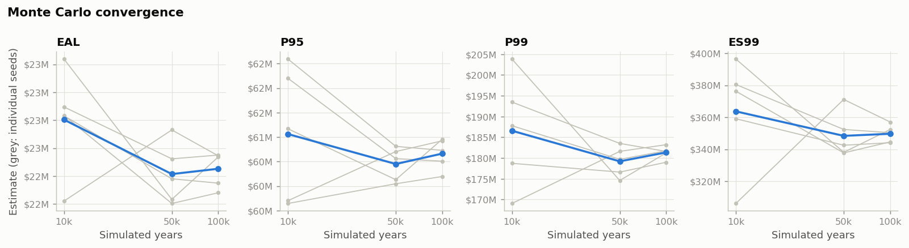

# Validation results

_Generated by `scripts/run_validation.py` (full mode). Unit tests (`pytest`) cover the analytical checks; this file covers model-level behaviour._

## 1. Monte Carlo convergence

Seeds: [1, 2, 3, 4, 5]. Coefficient of variation of each estimate across seeds (lower = more stable):

| simulated years | eal | p95 | p99 | es99 |
|---|---|---|---|---|
| 10000 | 0.016 | 0.022 | 0.072 | 0.096 |
| 50000 | 0.010 | 0.006 | 0.020 | 0.040 |
| 100000 | 0.006 | 0.005 | 0.008 | 0.016 |

Estimates per run (USD millions):

| n_years | seed | eal | median | p95 | p99 | es99 | se_eal |
|---|---|---|---|---|---|---|---|
| 10000 | 1 | 22.83 | 13.38 | 62.59 | 178.71 | 359.07 | 0.46 |
| 10000 | 2 | 22.89 | 13.47 | 59.70 | 193.47 | 380.48 | 0.47 |
| 10000 | 3 | 22.83 | 13.68 | 59.64 | 187.78 | 376.29 | 0.47 |
| 10000 | 4 | 23.24 | 13.57 | 61.17 | 203.84 | 396.40 | 0.47 |
| 10000 | 5 | 22.22 | 13.49 | 62.20 | 169.04 | 306.10 | 0.39 |
| 50000 | 1 | 22.38 | 13.53 | 60.81 | 176.60 | 342.50 | 0.19 |
| 50000 | 2 | 22.52 | 13.60 | 60.70 | 183.51 | 352.37 | 0.20 |
| 50000 | 3 | 22.20 | 13.42 | 60.05 | 179.67 | 337.71 | 0.19 |
| 50000 | 4 | 22.23 | 13.52 | 60.13 | 174.58 | 338.09 | 0.19 |
| 50000 | 5 | 22.73 | 13.46 | 60.56 | 181.59 | 371.12 | 0.21 |
| 100000 | 1 | 22.35 | 13.49 | 60.73 | 178.97 | 344.07 | 0.14 |
| 100000 | 2 | 22.55 | 13.61 | 60.92 | 181.58 | 350.34 | 0.14 |
| 100000 | 3 | 22.28 | 13.39 | 60.19 | 181.73 | 344.60 | 0.14 |
| 100000 | 4 | 22.54 | 13.55 | 60.96 | 181.23 | 352.31 | 0.14 |
| 100000 | 5 | 22.54 | 13.48 | 60.51 | 183.20 | 357.00 | 0.14 |

## 2. Event tree: analytic vs simulated outcome shares

Median parameters, 184,808 simulated releases. |z| < 3 expected for every row.

| outcome | analytic | simulated | events | z_score |
|---|---|---|---|---|
| controlled_release | 0.6557 | 0.6557 | 121186 | 0.05771 |
| uncontrolled_release | 0.329 | 0.3288 | 60762 | -0.1702 |
| minor_fire | 0.00852 | 0.008549 | 1580 | 0.1393 |
| major_fire | 0.005168 | 0.005303 | 980 | 0.8054 |
| explosion | 0.001507 | 0.001483 | 274 | -0.2743 |
| catastrophic | 0.0001578 | 0.0001407 | 26 | -0.5858 |

## 3. Dependence models A vs B

Frequencies are identical by construction; EAL rises slightly under B because frequency (integrity driver) and duration (logistics driver) co-move, so E[frequency × duration] > E[frequency] × E[duration].

| check | model_a | model_b | ratio_b_over_a |
|---|---|---|---|
| mean releases per year | 1.187 | 1.192 | 1.004 |
| mean compressor loss (USD) | 5.127e+06 | 5.255e+06 | 1.025 |
| EAL (USD) | 2.201e+07 | 2.26e+07 | 1.027 |
| P90 (USD) | 3.994e+07 | 4.229e+07 | 1.059 |
| P95 (USD) | 5.634e+07 | 6.081e+07 | 1.079 |
| P99 (USD) | 1.812e+08 | 1.865e+08 | 1.029 |
| ES99 (USD) | 3.543e+08 | 3.633e+08 | 1.025 |

Stress test with much stronger driver correlation (0.7–0.9), ratio to Model A: P95 1.153, P99 1.087, ES99 1.061, EAL 1.051

## 4. Optimisation: MILP vs exhaustive enumeration

| objective | milp_selection | milp_value_simulated | milp_value_predicted | exhaustive_best | exhaustive_value | feasible_portfolios | milp_rank | capex | budget |
|---|---|---|---|---|---|---|---|---|---|
| eal | inspection_programme + compressor_pm + critical_spares + ptw_competence | 4.876e+06 | 4.876e+06 | inspection_programme + compressor_pm + critical_spares + ptw_competence | 4.876e+06 | 114 | 1 | 5e+06 | 5e+06 |
| es99 | gas_detection_upgrade + critical_spares + ptw_competence | 8.553e+07 | 8.621e+07 | gas_detection_upgrade + critical_spares + ptw_competence | 8.553e+07 | 114 | 1 | 4.5e+06 | 5e+06 |

`milp_rank` = 1 means the MILP choice is also the best portfolio found by simulating every feasible combination.

## 5. Bayesian interval coverage

Truth drawn from the Beta prior, 624 demands per synthetic data set: nominal 90 % posterior intervals covered the truth in **90.0%** of 2000 repetitions.

## 6. Edge cases

| case | expected | result |
|---|---|---|
| bi_value_fraction = 0 | business interruption = 0 | BI total = 0 |
| all ignition probabilities = 0 | no fires or explosions | fires = 0, explosions = 0 |
| firewater header always failed | firewater PFD = 1 | PFD firewater (PPA) = 1.000 |
| one simulated year | runs | loss = 8,951,229 |
